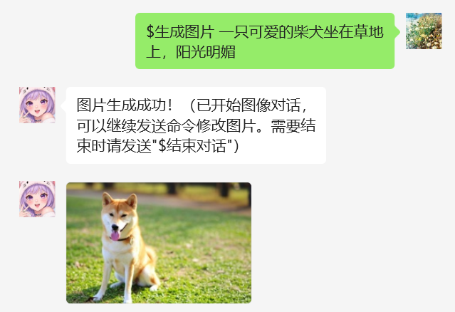
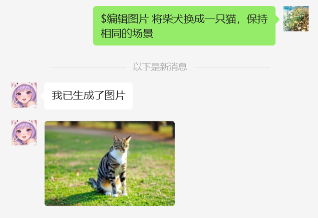

# GeminiImage 插件

基于Google Gemini的图像生成插件，使用Gemini 2.0 FlashExp模型生成和编辑图片。

> 本插件改编自XYbot的插件 [GeminiImage](https://github.com/NanSsye/GeminiImage)，感谢原作者的贡献。

## 功能特点

- 根据文本描述生成高质量图片
- 编辑已有图片，调整风格和内容
- 支持会话模式，可以连续对话修改图片
- 支持代理设置，方便国内用户使用

## 安装方法

1. 确保你已经安装了dify-on-wechat项目
2. 使用管理员插件安装：
   ```
   #installp GeminiImage.git
   ```
3. 安装完成后使用 `#scanp` 命令扫描加载插件
4. 配置插件：将 `plugins/GeminiImg/config.json.template` 复制为 `plugins/GeminiImg/config.json` 并编辑

## 配置说明

```json
{
  "enable": true,                                 # 是否启用插件
  "gemini_api_key": "your_api_key_here",          # Google Gemini API密钥
  "model": "gemini-2.0-flash-exp-image-generation", # 使用的模型名称
  "commands": ["$生成图片", "$画图", "$图片生成"],    # 生成图片的命令
  "edit_commands": ["$编辑图片", "$修改图片"],       # 编辑图片的命令
  "exit_commands": ["$结束对话", "$退出对话", "$关闭对话", "$结束"], # 结束对话的命令
  "save_path": "temp",                            # 图片保存路径
  "enable_proxy": false,                          # 是否启用代理
  "proxy_url": "",                                 # 代理服务器URL
  "base_url": "https://generativelanguage.googleapis.com"  # API基础URL
}
```

## 使用方法

### 生成图片

发送以下命令生成图片：
```
$生成图片 一只可爱的柴犬坐在草地上，阳光明媚
```



### 编辑图片

在生成图片后，可以继续发送命令编辑图片：
```
$编辑图片 将柴犬换成一只猫，保持相同的场景
```



或者直接发送描述继续对话：
```
给猫咪戴上一顶帽子
```

### 结束对话

当不需要继续编辑图片时，可以结束对话：
```
$结束对话
```


## 注意事项

1. 需要申请Google Gemini API密钥，可以在[Google AI Studio](https://aistudio.google.com/)申请
2. 国内用户可能需要使用代理才能访问Google API
3. 图片生成和编辑可能需要一些时间，请耐心等待
4. 每个会话的有效期为10分钟，超时后需要重新开始
5. 不支持生成违反内容政策的图片，如色情、暴力等内容

## 版本历史

- v1.0.0: 初始版本，支持基本的图片生成和编辑功能
- v1.1.0: 添加临时文件自动清理功能，支持自定义API基础URL，优化图片缓存机制

## Star History

[](https://star-history.com/#sofs2005/GeminiImg&Date)

## 打赏支持

如果您觉得这个插件对您有帮助，欢迎扫描下方二维码进行打赏支持，让我能够持续改进和开发更多实用功能。


