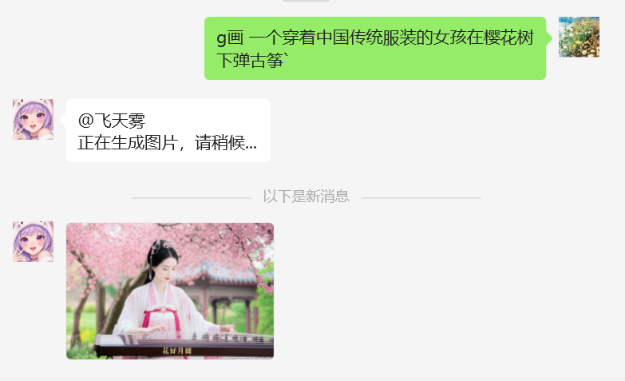

# 🎨 Gemini 图像生成器 (GeminiImage) v2.0.0

> 🚀 使用 Google 最先进的 Gemini AI 模型生成和编辑精美图像！
> **本插件基于老夏原版修改，从DOW平台迁移到XXXBOT平台，提供完整的图像生成、编辑和融合功能。**

## ✨ 功能特点

- 🖼️ **AI 图像生成** - 从文本描述生成高质量图像
- 🎭 **图像编辑** - 修改现有图像，添加新元素或改变风格
- 🔄 **图像融合** - 支持多张图片融合，创造独特效果
- 🔍 **反向提示词** - 从图片反向生成详细的提示词描述
- 📝 **提示词增强** - 自动将简单描述转化为详细的AI绘画提示词
- 💬 **上下文对话** - 支持多轮对话，连续优化你的创意
- 🔄 **自动使用上一张图片** - 多轮对话时自动将上一次生成的图片作为下一次编辑的输入
- 📝 **显示 AI 文本解释** - 展示模型对生成图片的文字解释，帮助理解创作过程
- 🌐 **代理支持** - 支持 HTTP/SOCKS 代理，解决网络访问问题
- 🚪 **手动结束对话** - 支持随时结束对话会话，提高资源利用效率
- 🧠 **Gemini 2.0** - 使用 Google 最新的 Gemini 2.0 Flash 实验版模型
- 🔄 **简单易用** - 简洁的命令，快速获得结果
- ⏱️ **消息延迟控制** - 优化图文消息发送顺序，确保用户体验

## 📋 使用指南

### 图像生成命令

使用以下命令生成图像：

```
#生成图片 [你的描述]
#画图 [你的描述]
#图片生成 [你的描述]
g画 [你的描述]
```

### 图像编辑命令

上传图片并添加以下描述：

```
#编辑图片 [编辑描述]
#修改图片 [编辑描述]
g改 [编辑描述]
```

### 图像融合命令

先发送融合命令，然后上传图片，最后发送开始融合命令：

```
#融图 [可选描述]    或    g合 [可选描述]
(上传多张图片，最多5张)
#开始融合    或    g开始
```

### 反向提示词命令

从图片生成详细的提示词描述：

```
#反推提示 (可选：上传图片)
#反推 (可选：上传图片)
g反推 (可选：上传图片)
```

### 提示词增强命令

将简单描述转化为详细的AI绘画提示词：

```
#提示词 [简单描述]
#生成提示词 [简单描述]
g提示词 [简单描述]
```

### 结束对话命令

使用以下任一命令结束当前对话：

```
#结束对话
#退出对话
#关闭对话
#结束
g结束
```

### 🔄 连续对话

启动对话后，可以直接发送新消息调整或修改，无需重复命令前缀。系统会自动使用上一次生成的图片作为输入，例如：

1. 首先发送：`#生成图片 一只猫咪`
2. 然后直接发送：`给它戴上一顶帽子`（无需命令前缀）
3. 再发送：`背景改成草地`（会基于上一张图片继续修改）
4. 最后发送：`#结束对话`（结束当前会话，释放资源）

## 💎 示例提示词

### 生成图像

- `g画 一个穿着中国传统服装的女孩在樱花树下弹古筝`
- 

### 编辑图像

- `g改 将背景改为繁华的城市街道`

### 融合图像

- `#融图 将这些图片融合成一个梦幻场景`
- `g合 创造一个融合了所有元素的奇幻世界`

### 反向提示词

- `#反推提示` (上传一张图片)
- `g反推` (引用一张图片)

### 提示词增强

- `#提示词 一个森林中的小屋`
- `g提示词 太空中的宇航员`

## ⚙️ 配置说明

在 `config.toml`中设置：

```toml
[GeminiImage]
# 基本配置
# 版本号: 2.0.0
enable = true
gemini_api_key = "你的API密钥"  # Gemini API密钥
model = "gemini-2.0-flash-exp-image-generation"  # 使用的模型名称
base_url = "https://generativelanguage.googleapis.com"  # API基础URL

# 命令配置
commands = ["#生成图片", "#画图", "#图片生成", "g画"]  # 生成图片的命令
edit_commands = ["#编辑图片", "#修改图片", "g改"]      # 编辑图片的命令
exit_commands = ["#结束对话", "#退出对话", "#关闭对话", "#结束", "g结束"]  # 结束对话的命令

# 新增命令配置
merge_commands = ["#融图", "#合成图片", "g合"]  # 融合图片的命令
start_merge_commands = ["#开始融合", "#生成融图", "g开始"]  # 开始融合的命令
image_reverse_commands = ["#反推提示", "#反推", "g反推"]  # 反向提示词命令
prompt_enhance_commands = ["#提示词", "#生成提示词", "g提示词"]  # 提示词增强命令

# 积分系统配置
enable_points = true     # 是否启用积分系统
show_points_message = true  # 是否显示积分相关消息
generate_image_cost = 10  # 生成图片消耗的积分
edit_image_cost = 15      # 编辑图片消耗的积分
merge_image_cost = 20     # 融合图片消耗的积分
reverse_image_cost = 5    # 反向提示词消耗的积分

# 图片保存配置
save_path = "temp"        # 临时保存生成图片的路径

# 超级用户设置，可免费使用
admins = []               # 管理员列表

# 代理配置
enable_proxy = false
proxy_url = "http://127.0.0.1:7890"  # 代理地址，格式如：http://127.0.0.1:7890 或 socks5://127.0.0.1:1080

# 群聊中继续对话的唤醒词
wake_words = ["#生成图片", "#画图", "#图片生成", "#编辑图片", "#修改图片", "#继续", "#图片", "#修改", "#融图", "#合成图片", "#反推提示", "#反推", "#提示词", "#生成提示词"]

# 机器人名称配置（用于检测@消息）
robot_names = ["XXXBOT", "机器人"]

# 提示词增强相关配置
enhance_prompt = true  # 是否启用提示词增强
prompt_model = "gemini-2.0-flash"  # 用于增强提示词的模型
reverse_model = "gemini-2.0-flash"  # 用于反推提示词的模型

# 图片融合相关配置
max_merge_images = 5  # 最大融合图片数量
merge_image_wait_timeout = 180  # 等待融图图片的超时时间(秒)

# 反向提示词生成相关配置
reverse_image_wait_timeout = 180  # 等待反推图片的超时时间(秒)

# 重试机制相关配置
max_retries = 3  # 最大重试次数
initial_retry_delay = 1  # 初始重试延迟（秒）
max_retry_delay = 10  # 最大重试延迟（秒）
```

### 代理设置说明

如果您无法直接访问 Google Gemini API，可以配置代理：

1. 将 `enable_proxy`设置为 `true`
2. 在 `proxy_url`中设置您的代理服务器地址：
   - HTTP 代理格式：`http://127.0.0.1:7890`
   - SOCKS5 代理格式：`socks5://127.0.0.1:1080`

注意：使用代理前请确保代理服务器正常工作且能访问 Google 服务。

## 📊 积分系统

- 生成图片：消耗 10 积分
- 编辑图片：消耗 15 积分
- 融合图片：消耗 20 积分
- 反向提示词：消耗 5 积分
- 管理员可免费使用

## 📝 开发日志

- v1.0.0: 初始版本发布（DOW平台）
- v1.1.0: 添加上下文对话支持
- v1.2.0: 添加文本响应显示和自动使用上一张图片功能
- v1.3.0: 添加代理支持，解决网络访问问题
- v1.4.0: 添加手动结束对话功能
- v2.0.0: 从DOW平台迁移到XXXBOT平台，添加图像融合、反向提示词、提示词增强功能

## 👨‍💻 作者

**给个 ⭐ Star 支持吧！** 😊

**开源不易，感谢打赏支持！**


## 📄 许可证

MIT License

如有任何问题或建议，请提交Issue或联系作者。
